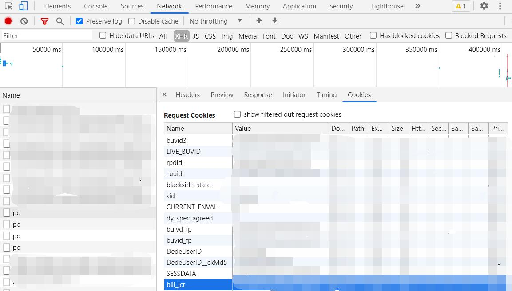
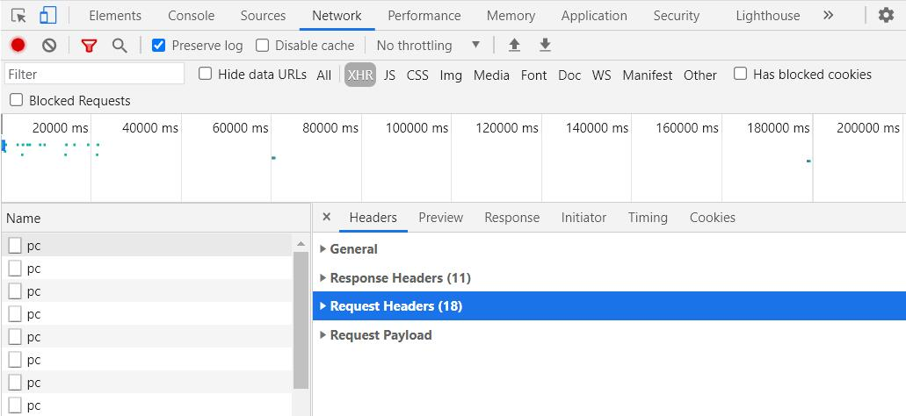

# Bilibili-Subtitle-Batch-Uploader

b站字幕批量上传工具，主要用于解决搬运公开课字幕上传的问题，名字来源：

**Bi**libili-**S**ubtitle-**B**atch-**U**ploader -> bisbu


## 参考资料

工具整体思路参考博客：

https://blog.l0v0.com/posts/55790015.html

部分代码借鉴了：

https://github.com/FXTD-ODYSSEY/bilibili-subtile-uploader


## 使用说明

### 安装

#### pypi安装（推荐）

```
pip install bisbu
```


#### 源码安装

下载仓库，使用命令

```
git clone https://github.com/Doraemonzzz/Bilibili-Subtitle-Batch-Uploader
```

在下载仓库目录下启动终端，运行如下命令进行安装

```
pip install -e .
```


#### 添加环境变量

windows需要添加环境变量，以Anaconda为例，需要添加：

```
D:\Anaconda3\Scripts
```


### 配置文件

新建配置文件bisbu.conf，内容如下：

- sub_dir：字幕文件夹所在的绝对路径，**注意只能使用全英文路径!**

- bvid：视频bv号，例如视频https://www.bilibili.com/video/BV1Jq4y1j7jC/的BV号为1Jq4y1j7jC

- csrf：即bili_jct，以谷歌浏览器为例：

  - 登录https://www.bilibili.com/

  - F12打开开发者工具

  - 选择Network，XHR，刷新页面，选择Name中的pc，选择Cookies，找到bili_jct，复制其Value即可：

    

- cookie：以谷歌浏览器为例：

  - 登录https://www.bilibili.com/

  - F12打开开发者工具

  - 选择Network，XHR，刷新页面，选择Name中的pc，找到Headers中Request Headers中cookie，复制cookie后的全部内容：

    

    

样例：

```
--sub_dir dir
--bvid 1d64y1d7ap
--csrf csrf
--cookie "your cookie"
```

注意，cookie中由于含空格，所以必须要加双引号。


### 运行

在bisbu.conf所在目录下启动终端，配置好bisbu.conf文件，运行如下命令即可自动上传：

```
bisbu
```


## 注意事项

字幕和b站上传视频的名称必须一一对应，例如某个视频的名称为：

```
[2020-12-26] 20.2 Cramér's LDP, Part 2
```

那么字幕的名称应该为：

```
[2020-12-26] 20.2 Cramér's LDP, Part 2.en.srt
[2020-12-26] 20.2 Cramér's LDP, Part 2.zh-Hans.srt
[2020-12-26] 20.2 Cramér's LDP, Part 2.zh-Hans-en.srt
```


## 参考资料

https://github.com/JunzhouLiu/BILIBILI-HELPER

https://github.com/FXTD-ODYSSEY/bilibili-subtile-uploader

https://blog.l0v0.com/posts/55790015.html